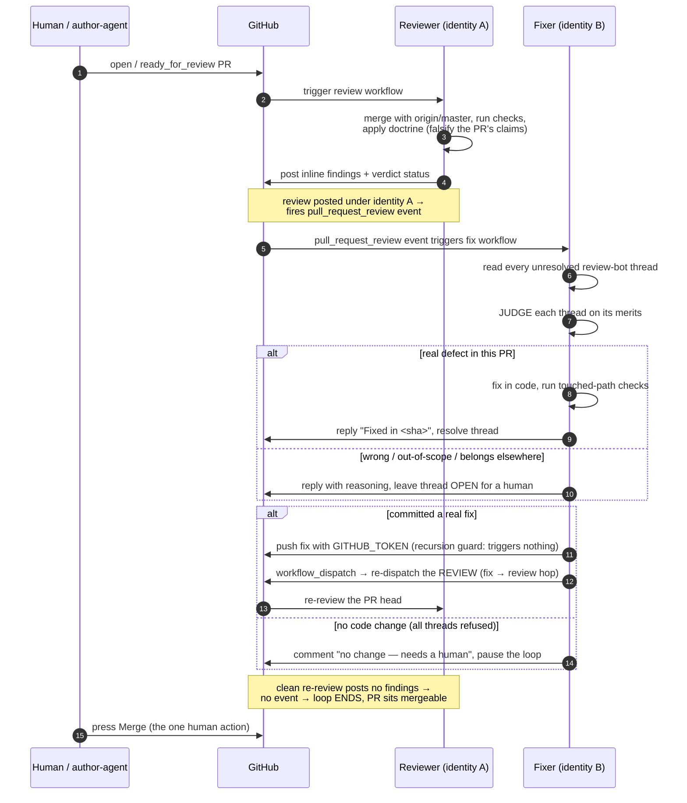

# Architecture

How the loop works mechanically. The v1 engine is two GitHub Actions workflows plus a
CLI and a policy file, generalized from a production deployment. The hosted app (phase
2) is sketched at the end as future work.

## Identities

The loop uses **two distinct identities**, and that separation is load-bearing:

- **Reviewer (identity A).** Posts the review — inline findings and the verdict.
  Because it posts under a GitHub App identity, its review **fires a
  `pull_request_review` event**, which is what triggers the fixer. (In the source
  deployment this is `claude[bot]`; GraphQL drops the suffix to `claude`.)
- **Fixer (identity B).** Pushes fix commits and replies to threads, using the default
  `GITHUB_TOKEN`. A `GITHUB_TOKEN` push **triggers no workflow** (GitHub's recursion
  guard), so the fix does not re-run the loop on itself. (In the source deployment this
  is `github-actions[bot]`.)

Why two identities: nothing can self-approve (GitHub blocks any identity from approving
a PR it authored), and the loop stays **directional** — a review triggers a fix, a fix
never triggers a fix.

## The verdict

The reviewer ends with one summary verdict: **`MERGE` / `MERGE-WITH-FIXES` /
`DO-NOT-MERGE`**, published as a **non-blocking commit status by default**. A team can
mark that status required itself once it trusts the false-positive rate — Latch never
imposes a hard gate by default (a required check driven by a probabilistic agent is a
self-DoS; see [STRATEGY.md](./STRATEGY.md#the-three-corrections-adopted)).

## The sequence



## The guards, precisely

1. **Anti-tamper.** Before doing anything, the fixer checks the PR's changed files; if
   any match `^\.github/workflows/` or `^\.latch/` (anything under `.latch/`), it
   **skips** — a fixer that could edit the workflows or policy under review is exactly
   what must not be built.
2. **Cycle cap.** At most **3 fixer cycles per PR**, tracked with a `latch-cycle:N`
   label. A cycle is consumed only when a real fix lands. On the cap, the fixer
   @-mentions the author, explains what it could not settle, and stops — it will not
   run again until the `latch-cycle:*` labels are cleared.
3. **Actionable check.** The fixer runs only when there is at least one *unresolved*
   thread whose first comment is by the reviewer identity — so a review event that
   fires with nothing left to do is a no-op, not a wasted run.
4. **Termination.** A clean review posts no inline findings, so it submits no
   `COMMENTED` review, so no `pull_request_review` event fires and the fix workflow
   simply does not run again. **The loop ends on its own when the review is clean.**
5. **Checks before commit.** The fixer runs the touched-path check commands (e.g.
   `cargo fmt/clippy/test`, `npm lint/tsc/build`) and keeps a fix only if its checks
   pass — never leaving a red tree. Toolchains it doesn't have installed (mobile
   builds) are declared plainly in the thread reply, with the re-dispatched review and
   the human merge as the backstop.

## The fixer's judgment (STEP 2)

The fixer does **not** blindly comply. For each unresolved reviewer thread it reads the
surrounding code and decides:

- **(a) a legitimate defect in this PR's code** → fix it, reply `Fixed in <sha>: …`,
  resolve the thread;
- **(b) it disagrees after reading the code, or the action belongs on a different
  branch/PR** → change nothing, reply with concrete reasoning, and **leave the thread
  open for a human**.

The reviewer is skeptical and usually right, but not always. This standing-to-refuse is
what stops the loop thrashing on a wrong review comment, and — shown in a demo — it is
the single highest-credibility moment: a scripted fake never argues with itself.

## Why every hop is its own run

Because the fixer's `GITHUB_TOKEN` push triggers nothing, the fixer must **explicitly**
re-dispatch the review via `workflow_dispatch`. That means review, fix, and re-review
are each a **separate, auditable Actions run** with its own timestamp — no PAT, deploy
key, or app token is used to make a bot push "trigger naturally." The audit trail
(review under A → fix under B → re-review under A, three runs) is impossible to fake
with a video cut, which is a deliberate honesty property (see the launch runbook in the
private ops repo `github.com/nishantkumar1292/latch-ops`).

One subtlety carried from the source deployment: a re-dispatched review arrives as a
`workflow_dispatch` with no `pull_request` in its payload, so the workflow synthesizes a
real `pull_request` event payload for the target PR and points the action at it — so the
dispatched re-review resolves the PR exactly like a native one. Concurrency is scoped
per-PR **and per event type**, because the reviewer's own inline comments fire events
that must not cancel the reviewer mid-post.

## Hosted app sketch (phase 2 — future)

```
GitHub PR event ─▶ [App webhook receiver] ─▶ [queue] ─▶ [sandbox runner pool] ─▶ GitHub
   (opened/sync/     verify HMAC sig,          (Redis/    ephemeral container:      (status +
    review submitted, dedupe by repo#pr,        SQS)       clone → review OR fix     inline
    requested_action) enqueue one job                      → post → re-dispatch      comments +
                                                           → destroy)                fix push)
                                                              │
                                                              ▼
                                                   [policy store]   [inference plane]
```

Design intents for the hosted app (none built yet):

- **Two identities** preserved: the App token posts reviews/statuses; fix commits push
  under a distinct identity (v1 cut: committer-login guard on one App; upgrade to a
  second "Latch Fixer" App when it bites).
- **Webhook → queue → ephemeral sandbox per job.** The runner is stateless and
  destroyed after each job — clone into tmpfs, never persist the working tree. This is
  what lets us own latency (warm pool), not consume the customer's Actions minutes, and
  meter our own inference bill. **No customer-code retention** — a sales requirement,
  cheap because the runner is already ephemeral; retain only metadata (verdicts, thread
  IDs, cycle counts, timings, redacted findings for the dashboard).
- **Hosted defaults follow the corrections:** non-blocking verdict, suggested changes a
  human applies; required-check and silent-push are per-repo opt-ins.
- **The escaped-bug / false-negative metric** is a core artifact from the first design
  partner, not an afterthought — independence you can't prove is theater.

Keep the runner **model-pluggable** so we are never single-supplier-locked and so
"bring your own model / Bedrock / Vertex" is a real enterprise option — and so the
**model-independence knob** (review with a model unlike the author-agent) is real.
